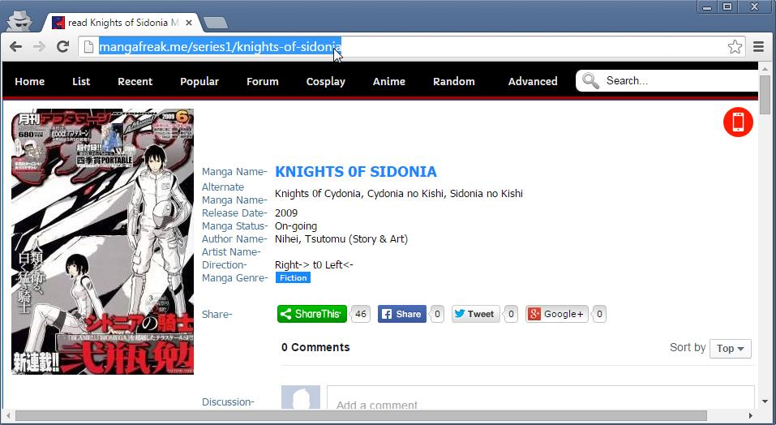
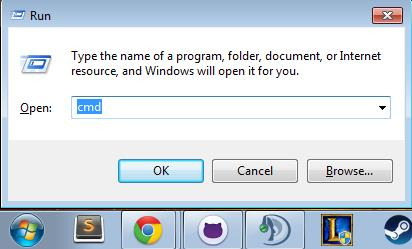
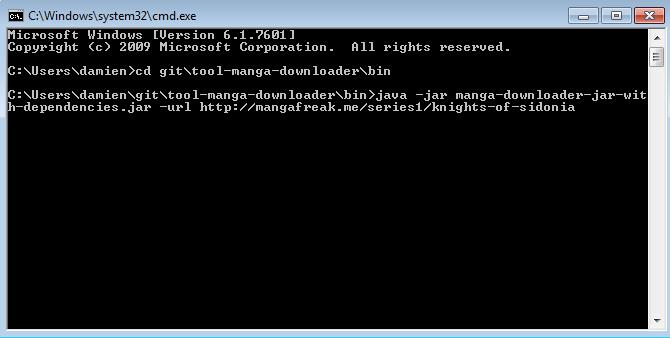
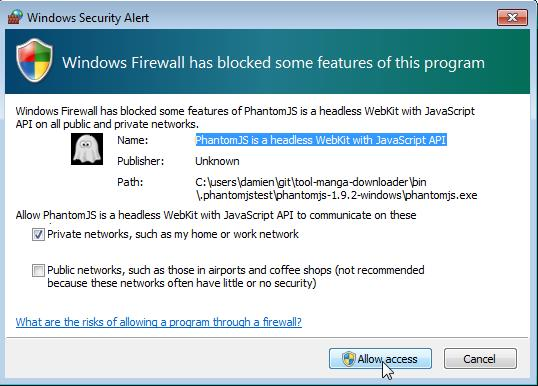
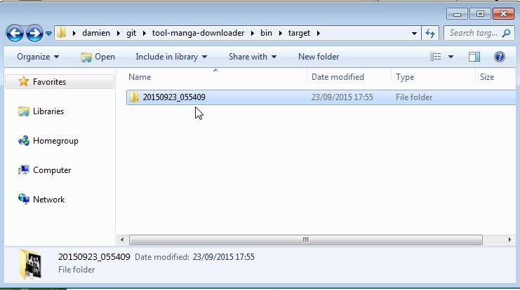

# Manga Downloader

Extract and download full online manga from websites like http://mangafreak.me/.

## Usage

* launch with command from bin folder
java -jar manga-downloader-jar-with-dependencies.jar -url <serie-url>
* accept security exception for phantomjs browser
* wait for ending...
* get the result in generated target folder

## Example

URLs for MangaFreak
* This URL will download the serie: http://mangafreak.me/series1/knights-of-sidonia
* This URL will download the chapter: http://mangafreak.me/read1/knights-of-sidonia/1

URLs for MangaHere
* This URL will download the serie: http://www.mangahere.co/manga/sidonia_no_kishi/
* This URL will download the chapter: http://www.mangahere.co/manga/sidonia_no_kishi/v01/c000/

## Example for a serie

java -jar manga-downloader-jar-with-dependencies -url http://mangafreak.me/series1/knights-of-sidonia

result: in folder target/2015...

## Example for a chapter

java -jar manga-downloader-jar-with-dependencies -url http://www.mangahere.co/manga/sidonia_no_kishi/v01/c000/

result: in folder target/2015...

(WORK IN PROGRESS)
